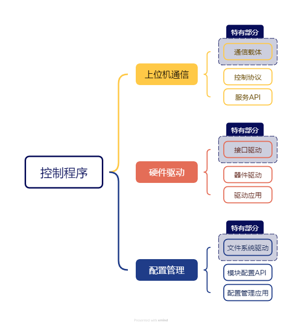

# UV-Master

[English](README.md) | 简体中文

本项目是基于嵌入式系统的高模块化、高移植性的水下机器人控制程序，采用抽象层分离逻辑与硬件，兼容多种控制平台，并已在基于 Allwinner H3 和 WCH CH32V307 的硬件平台中测试成功。

## 一、功能

1. 远程控制机器人
2. 算法提供定向、定深功能
3. 收集传感器数据
4. 可选外设（灯、机械臂、声纳等）
5. 网络OTA

## 二、项目结构

### 通信抽象层（CAL）

目前仅有 HTTP 服务端搭配 JsonRPC 协议一种方案。

#### 接口

tcp_server.c

#### 驱动

rpc_cjson.c

#### 应用

uvm_cal.c

### 硬件抽象层（HAL）

目前接口部分仅有 Linux 系统相关硬件驱动。

#### 接口

interface_xxx.c（内容为 utils 内各接口函数调用）

#### 驱动

driver_xxx.c

#### 应用

xxx.c

### 配置管理器（CFG）

目前仅有基于 Linux 文件系统下的配置管理。

#### 接口

uvm_cfg_intf.c

#### 驱动

cfg_xxx.c

#### 应用

uvm_cfg.c